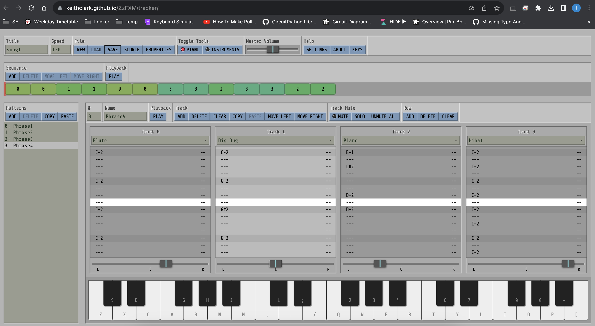
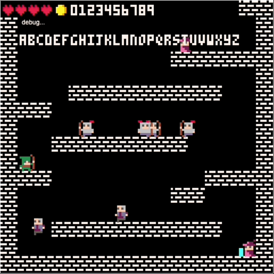
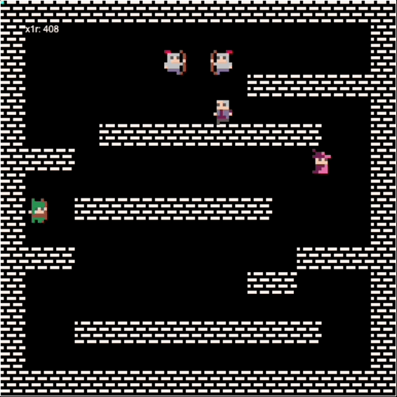
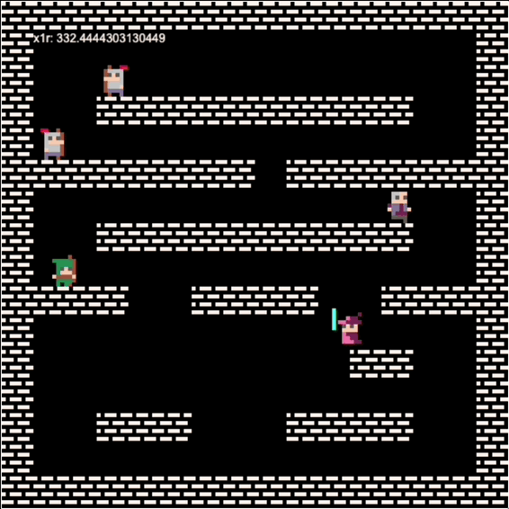
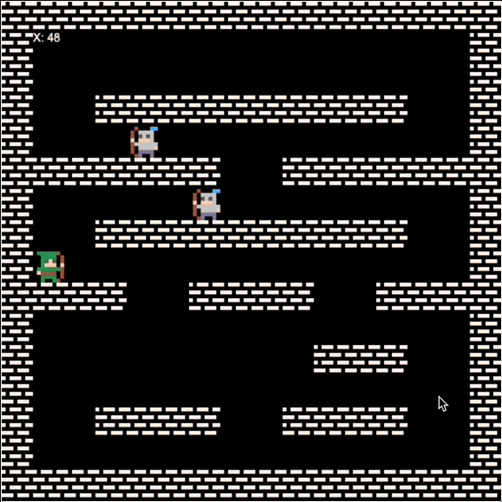
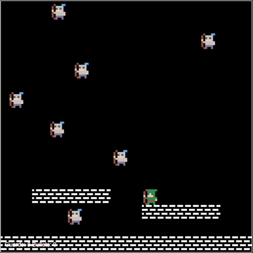

# WANTED

WANTED is a platformer video game. It is my entry to the JS13KGAME 2023 game jam, with the topic 13th Century.

To pack the game, use this command:

```npx js13k-packer index.html dist```

### September 12th, 2023

A few hours before submission death line!

I am pretty happy with the game. I think I will submit now.

I added FXs and cleaned the code. The zip file is at 12840b.

I will leave the TODO list here, in the last blog post. I had to de-scope several things. Unfortunately I did not start the TODO list from the beginning. I usually leave the de-scoped items in the list, but this time I remove them (also unfortunately).

Late TODO List

- [x] Sprites
    - [x] Hearts (red and gray)
    - [x] Coins
    - [x] Better walls/floors sprites
    - [x] Door to spawn characters
- [x] Pixel art fonts
- [x] Implement health system
    - [x] Display hearts
    - [x] Invisible period
    - [x] Health counter
- [x] Implement money in pocket (score)
    - [x] Collision with the coins
    - [x] Coins counter
    - [x] Display money count icon
    - [x] Display money count
- [x] Implement stealing the money from the rich:
    - [x] Blink coins before they disappear
    - [x] Coins jumping from the person to the floor and disappearing after some time
- [x] Guards and rich people spawner
- [x] Beat guards particles effect
- [x] State machine
    - [x] HUD
    - [x] Controls screen
    - [x] Game
    - [x] Game over screen
    - [x] Pause screen
- [x] Bug: arrows disappear when one hits a wall
- [x] Sound FX
- [x] Background music

### September 12th, 2023

Feeling the pressure!

I have not posted any updates in the last several days. But I was working on the state machine, the GUI and the different screens.

That was actually easy!

Then a moved to the sound effects and the music. I had never used these super cool libraries:

https://github.com/KilledByAPixel/ZzFX
https://github.com/keithclark/ZzFXM

I also had to learn how to use this tracker to compose the music!

I will try to add a bit more juice and finish the game over screen.



### September 6th, 2023

I have been having good progress:

I implemented:

- health or lives for the player
- graphics that show the player's lives (harts)
- blinking of the player (invisibility) when he gets hit by a guard
- spawning of coins with animation
- collection of those coins
- blinking for the coins when they are going to disappear
- a print function to display text on specific coordinates of the screen, with the specified color
- pixel art fonts

Someone told me this on Discord about optimizing fonts:

> subpixel — Today at 9:15 AM
Yup, a pixel array isn't a bad way to go, especially with JavaScript's sparse array notation. This is where the code golfing fun starts though! If you find yourself running out of space later, and needing to do a whole font of 4x5 letters, try this nonsense: 
'c444e'.split('').map(c=>parseInt(c,16).toString(2).padStart(4,'0').split('')) 
That assumes it's unpacking each line of your bitmap, 4 bits, from a single hex character, so 'c444e' is your number 1. You end up with an array like you have above, but with '0' and '1'. It's a lot of unpacking code, but if you did dozens of characters, it'd break even at some point, and then pull ahead. Happy golfing!

I am happy with this progress, and the game is starting to feel fun:



### September 3rd, 2023

Yesterday I couldn't work on the game, and today I am just trying to understand what I should do next. So, I will create a checklist that I will put above.

But the last thing I did was I designed the room (might be the only room, but I will try to make more if I have time), and I optimized the collision detection for the characters (people and Robin), so everybody is able to better navigate the room.

It was challenging to come up with a solution for the enemies and the rich people for them to be able to jump around without getting stuck anywhere.

Things are looking better:



### August 31st, 2023

In the last days I was working on a couple of refactors:

First, I consolidated the sprites in a single sprite sheet. This way I will end up only with two images: one for the tile map and one for the rest of the images.

To do this, I created one SpriteSheet object, and defined animations for each type of entity that will be present on the screen: guards, coins, characters, etc.

This helped me reduce the size of the final ZIP file like this:

11465 bytes ➡️ 9609 bytes

The second refactor was to replace the "guards" array with a "people" array (including the functions that manipulate this array).

This way I ended up with a set of functions that control all the characters, the guards (enemies) and the rich people. The same code enables all the characters to navigate the scene.

Right now I am at 9731 bytes.



I can do this!

### August 28th, 2023

It's all about the shrinking!

Not the best weekend: I lost too much time trying to use webpack or vite to bundle the code in a way that I was able to compress the deliverable to a reasonable size: in this case, because of the amount of code I had, no more than 7kb.

I had a problem with the images with the minified version of the code: the images were not loading. I think the problem was in the way I was configuring the project webpack and vite.

Unfortunately, I was not able to solve the issue, and I needed to keep writing the game. So I migrated from TypeScript to just JavaScript.

Not ideal, but once I migrated, I was able to restart coding, now knowing that my project will be able to fit within the 13kb this game jam is all about.

I also started implementing the enemies.

I only have just over 2 weeks, though, and I still have a lot to do!

It's been fun!



### August 24th, 2023

Today I finished the implementation of the player's movement and its animations.

Kontra.js has a pretty neat and easy to use system to setup a sprite sheet and create animations for every state you need for your character!

The movement with the animations took me a bit more than a couple of days, because I also had to draw the sprites, but I am really happy with the result!

I feel I will be able to implement the game play pretty fast after this.


### August 21st, 2023

8 days have past, and I just have the bare bones of my game! I was moving, so I didn't have much time to work.

At least, I have the idea and a project to build from: it will be a platformer where you are Robin Hood, taking money from the rich to give it to the poor, while you fight the guards!


